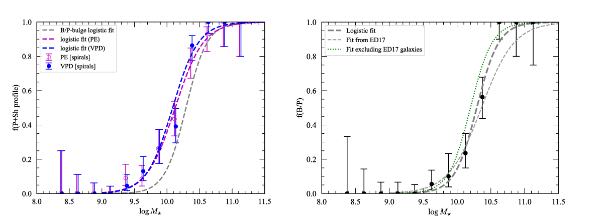

# Public data, code, and notebooks for paper analyzing bar-major-axis profiles

This git repository contains data files, Python code, and Python and R 
Jupyter notebooks which can be used to reproduce figures and analyses
from the paper "The Profiles of Bars in Barred Galaxies" (Erwin,
Debattista, & Anderson 2023, *Monthly Notices of the Royal Astronomical
Society*, submitted).

Logistic fits for Peak+Shoulders bar profiles (left) and B/P-bulge presence (right)
for barred spirals, versus galaxy stellar mass.

<!--  -->

## Data

The full set of *Spitzer* 3.6-micron images for the sample galaxies can be found
at, e.g., the [NASA Extragalactic Database](https://ned.ipac.caltech.edu); to
make it easier to reproduce the figures in the paper, we include sky-subtracted
versions of these images for xxx of the galaxies.

## Dependencies

The Python code and notebooks require the following external Python modules and packages,
all of which are available on PyPI and can be installed via `pip`:

   * [Numpy](https://www.numpy.org), [Scipy](https://www.scipy.org), 
   [matplotlib](https://matplotlib.org), [Astropy](https://www.astropy.org)

## Jupyter Notebooks

There are two Jupyter notebooks:

   * `barprofiles_figures_for_paper.ipynb` -- Python notebook; generates the figures for 
   the paper

   * `barprofiles_R_logistic-regression.ipynb` -- R notebook; computes logistic
   regressions

## Python Code

   * `angle_utils.py`, `barprofile_utils.py`, `plotutils.py` -- miscellaneous utility functions
   (including statistics).
   
<!-- 
   * `sample_defs.py` -- definitions of various subsamples of S4G galaxies, in the
   form of integer lists of index values (slices, more or less). **[FIXME]**
   
   * `fitting_barsizes.py` -- code to assist with the fits in the Jupyter notebook
   `barsize_fits.ipynb`. **[FIXME]**

   * `make_fit_tables.py` -- code to generate LaTeX tables for the paper **[FIXME]**
 -->

## How to Generate Figures and Analyses from the Paper

1. Download this repository.

2. Edit paths in the notebooks so they point to the correct locations, if necessary.
See notes in the initial cells of the notebooks; the main variable you will probably
need to edit is `plotDir` in the second cell of `barprofiles_figures_for_paper.ipynb`,
which is where saved PDF figures should go. Also make sure to set `savePlots = True`
if you want the PDF files to actually be generated (the default is `False`, which
means the figures will appear in the notebook but won't be saved to disk).

3. **Optionally:** Run the notebook
`barprofiles_R_logistic-regression.ipynb` to generate and save the
various logistic fits. This is "optional" in that the output files
already exist in this directory (they will be overwritten if the
notebook is run).

4. Run the notebook `barprofiles_figures_for_paper.ipynb` to generate the figures
(it will read the coefficients of the fits from the file generated by running the
previous notebook).

## Licensing

Code in this repository is released under the BSD 3-clause license.

 
Text and figures are licensed under a <a rel="license" href="http://creativecommons.org/licenses/by/4.0/">Creative Commons Attribution 4.0 International License</a>.
